<h1>Классификация изображений на основе сверточных нейронных сетей</h1>
<h2>Входящие файлы</h2>
<li>4140_CV_ЛР3_Строкова_AlexNet.ipynb - ноутбук с программным кодом на Python;
<li>4140_CV_ЛР3_Строкова_ResNet50.ipynb - ноутбук с программным кодом на Python;
<li>4140_CV_ЛР3_Строкова_VGG16.ipynb - ноутбук с программным кодом на Python;
<li>Каталог "Изображения" - исходные изображения.
<h2>Постановка задачи</h2>
Цель работы: научиться создавать простые системы классификации изображений на основе сверточных нейронных сетей.  
 
Базовый алгоритм: классификация. 
 
Задание: на вход поступает два изображения: на вход поступает изображение, которое преобразуется в нужный для обработки моделью нейронной сети формат (тензор), выполняется предобработка (при необходимости – изменение размера и нормирование), затем обрабатывается с помощью нейронной сети и выводится результат (номер класса, название, вероятность для первых 5-ти наиболее вероятных классов).  
 
Задачи: 
<li> реализовать систему классификации через AlexNet;
<li> реализовать систему классификации через ResNet50;
<li> реализовать систему классификации через VGG16;
<li> сравнить качество работы, скорость и количество потребляемой памяти для каждой архитектуры.
 
<h2>Теоретическая база</h2>
Для решения задачи классификации изображений используются сверточные нейронные сети. Набор изображений следующий: 
 

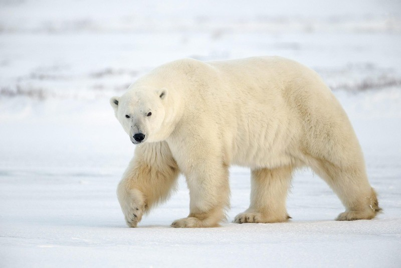

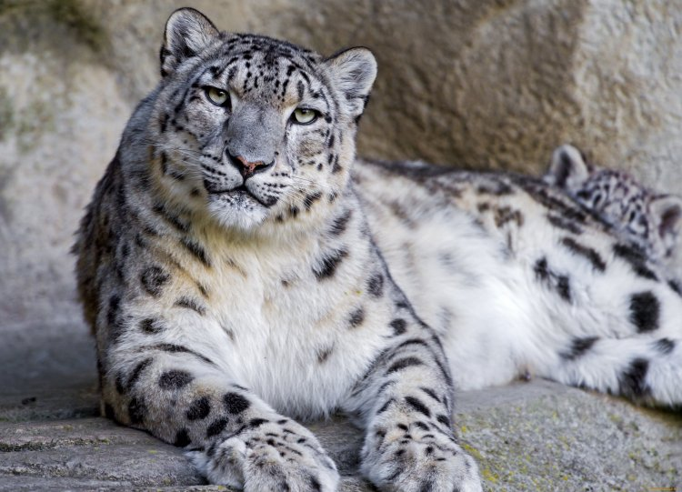

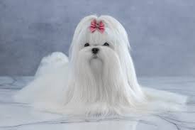

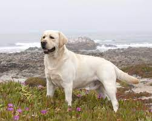

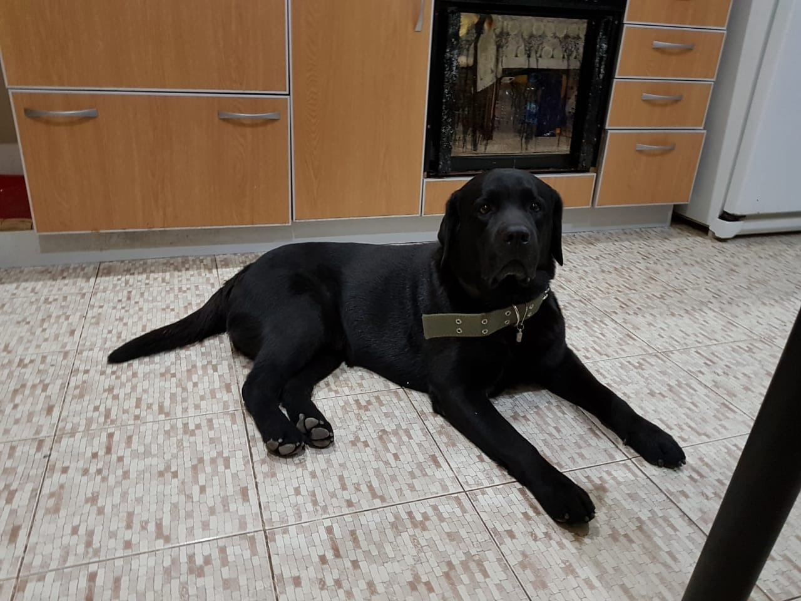
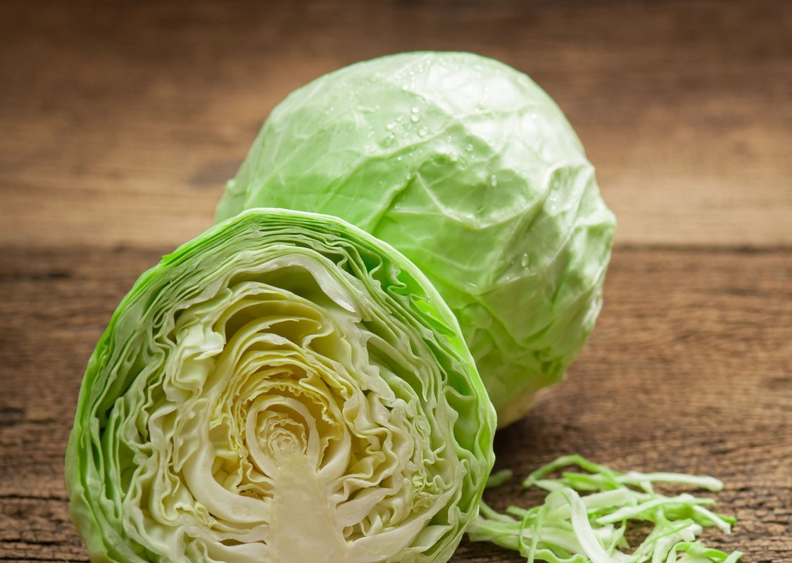
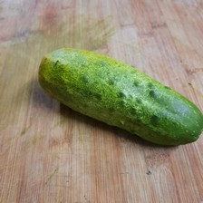

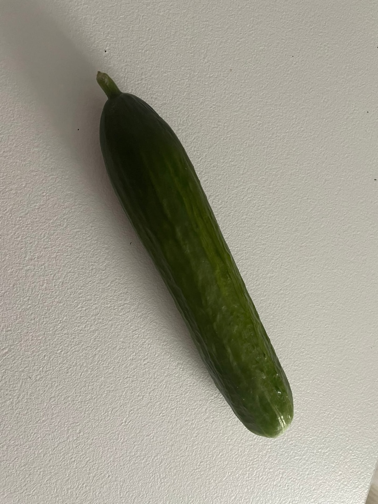

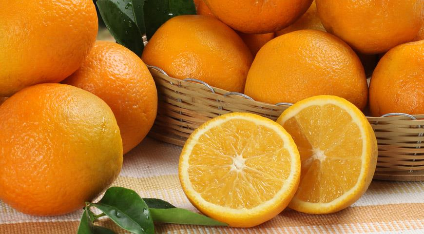
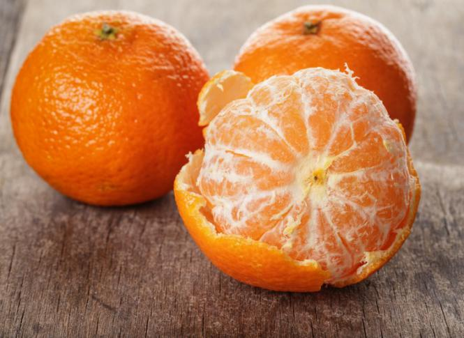
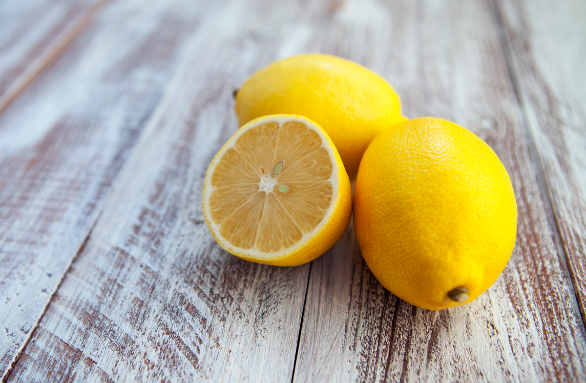
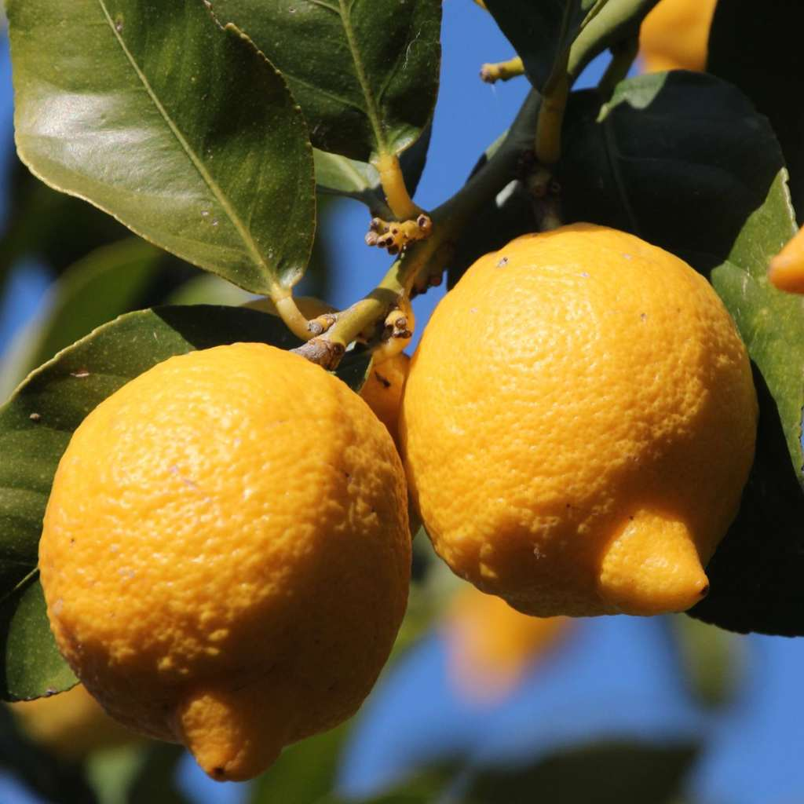

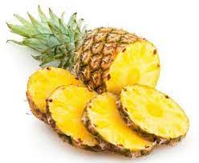
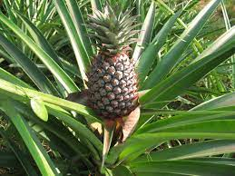

<h2>Выводы по работе</h2>
Проведена классификация пользовательского датасета изображений с использованием предобученных сверточных нейронных сетей: AlexNet, ResNet50, VGG16. 
 
На вход подавались 50 фотографий (скачаны с сети Интернет и сделаны самостоятельно). На выходе алгоритм выдавал изображение, которое классифицировалось, и 5 вероятностей отнесения фотографии к определенному классу.  

 
<table border="1">
   <tr>
    <th>Архитектура</th>
    <th>CPU times</th>
    <th>Wall time</th>
    <th>Top1</th>
    <th>Top5</th>
   </tr>
   <tr>
    <th>AlexNet</th>
    <th>77.3 ms</th>
    <th>82.7 ms</th>
    <th>78%</th>
    <th>96%</th>
   </tr>
   <tr>
    <th>ResNet50</th>
    <th>459 ms</th>
    <th>387 ms</th>
    <th>84%</th>
    <th>96%</th>
   </tr>
   <tr>
    <th>VGG16</th>
    <th>2080 ms</th>
    <th>1880 ms</th>
    <th>86%</th>
    <th>94%</th>
   </tr>
 </table>
